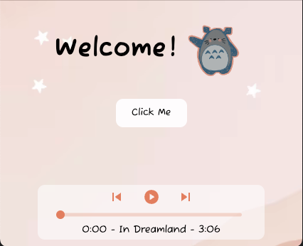
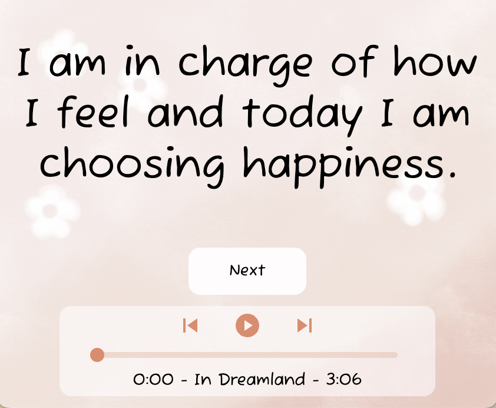

<h1 align="center">💖 Daily Affirmations 🎵</h1>

Daily Affirmations is a sleek, minimalistic audio player built with React and Electron. It allows users to play, pause, and skip through a curated playlist of relaxing tracks. Designed for simplicity and smooth playback, the player features a dynamic progress slider, real-time track switching, and seamless audio transitions. In addition to playing relaxing music, the app displays positive affirmations to encourage mindfulness and motivation throughout your day.

<h2 align="center">✨ Features ✨</h2>
⭐️ Built with Electron for a desktop-friendly experience <br>
⭐️ <strong>Daily affirmations</strong> to inspire and uplift you <br>
⭐️ Music Player built with Material UI icons <br>
⭐️ Next/Previous track functionality <br>
⭐️ Dynamic progress slider for seeking within a track <br>
⭐️ Auto-play when switching to the next song <br>
⭐️ Lightweight and easy to integrate into any React project <br>
<br>
🎶 Enjoy a peaceful listening experience while staying motivated with Daily Affirmations!

<div align="center">
  
  
</div>

<h2 align="center">Installation Instructions</h2>

```
Coming soon...
```


<h2 align="center">Tech Stack</h2>
<div align="center">
	
	
  
	
	
	
	
</div>
<br>

#### Starter Electron React Boilerplate:


<br>

<p>
  Electron React Boilerplate uses <a href="https://electron.atom.io/">Electron</a>, <a href="https://facebook.github.io/react/">React</a>, <a href="https://github.com/reactjs/react-router">React Router</a>, <a href="https://webpack.js.org/">Webpack</a> and <a href="https://www.npmjs.com/package/react-refresh">React Fast Refresh</a>.
</p>

<br>
